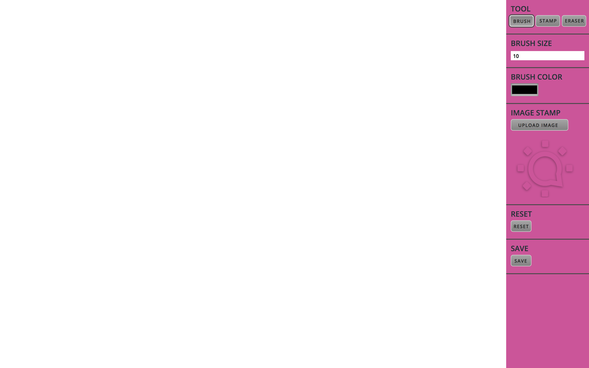

# Social Tables Front End Intern Challenge

## Instructions

```bash
git clone git@github.com:LaFrish/drawing-app-challenge.git
cd drawing-app-challenge
npm install
npm start
```
##Open [http://localhost:3000](http://localhost:3000)
---

## Challenge walkthrough

<strong>Drawing App Capabilities</strong>
* Paint Mode
* Image Stamp Mode
* Eraser Mode
* Reset Canvas
* Save Canvas
---
## Finished Product!



---

## Sites

* [Portfolio](http://lafrish.github.io/)
* [Resume](https://drive.google.com/open?id=0B9BDSYdQ3pr8eGxDbzB5SVVKLUdyWWJONHJpTGFBYkpGdFR3)
* [LinkedIn](https://www.linkedin.com/in/farishtahaider)
* [GitHub Repo](https://github.com/LaFrish)
